# Проект в разработке!

# Описание
Проект по разработке системы управления производственными цехами для нефтеперерабатывающей компании.

# Модули
+ [__База данных__](#база-данных)
  * [__Пользователи__](#пользователи)
  * [__Производственный цех__](#производственный-цех)
  * [__Табель рабочего времени__](#табель-рабочего-времени)
  * [__Табель сверхурочной работы__](#табель-сверхурочной-работы)
  * [__Табель работ в выходной день__](#табель-работ-в-выходной-день)
  * [__Отсутствия__](#отсутствия)
+ [__Аутентификация__](#аутентификация)
+ [__Модуль управления подразделением__](#модуль-управления-подразделением)
+ [__Модуль табеля учета рабочего времени__](#модуль-табеля-учета-рабочего-времени)
+ [__Модуль обучения__](#модуль-обучения)
+ [__Модуль инструктажей__](#модуль-инструктажей )
+ [__Модуль оборудования__](#модуль-оборудования)
+ [__Модуль плановых производственных работ__](#модуль-плановых-производственных-работ)

## База данных
На диаграммах прямоугольниками представлены таблицы, которые определены в прочих разделах базы данных.

### Пользователи
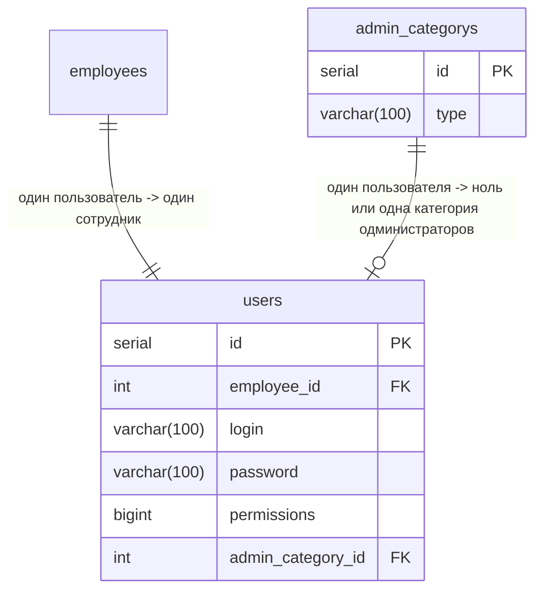
### Производственный цех
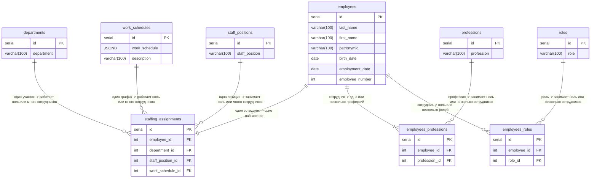

### Табель рабочего времени
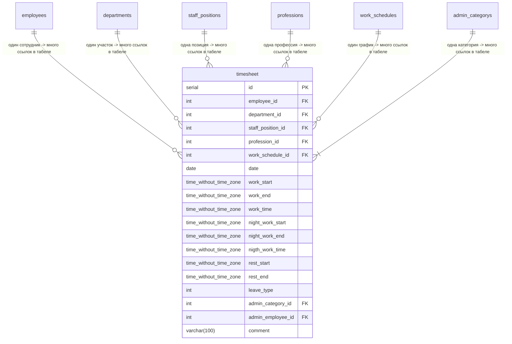
### Табель сверхурочной работы
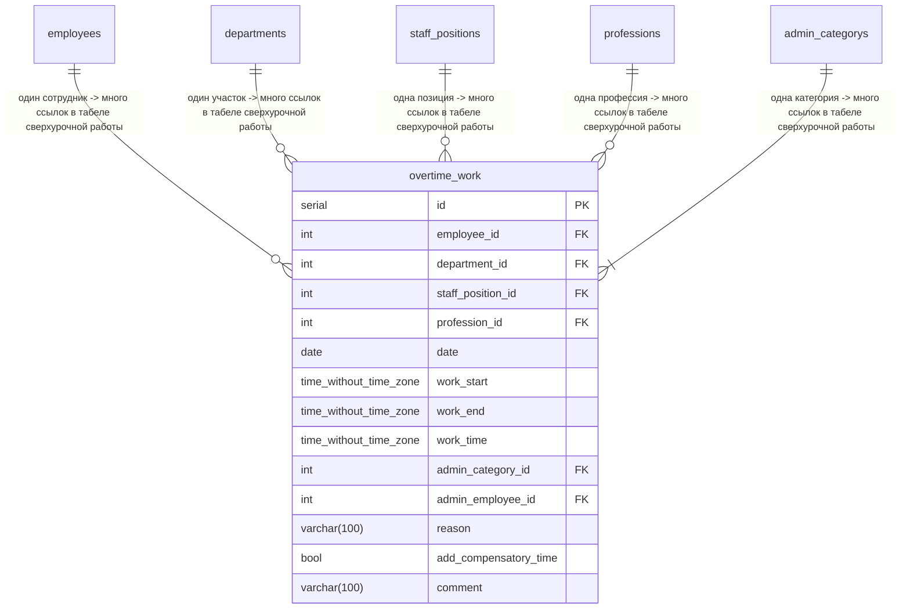

### Табель работ в выходной день
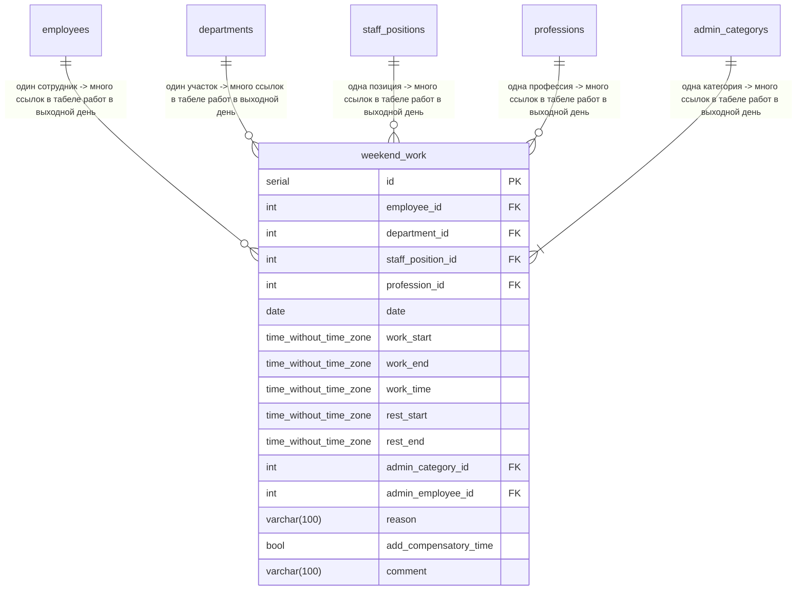

### Отсутствия
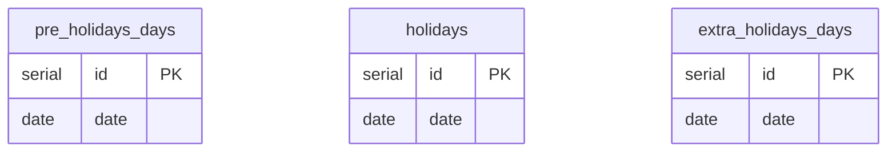
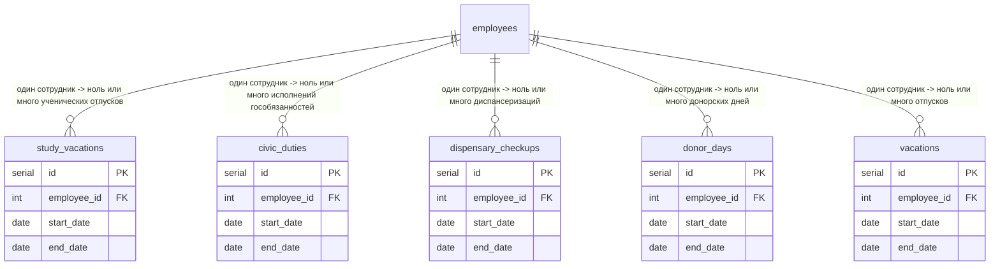
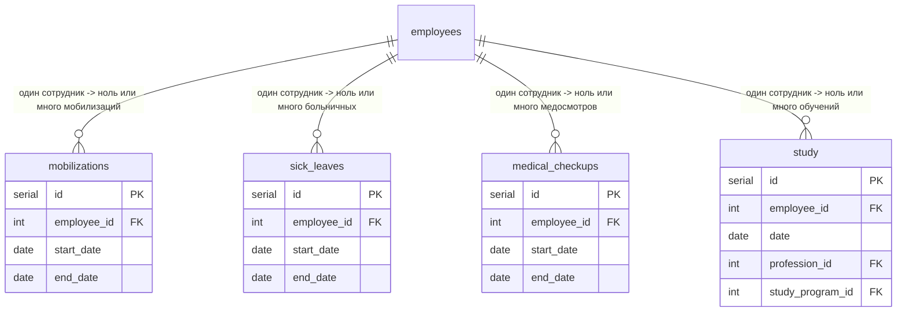
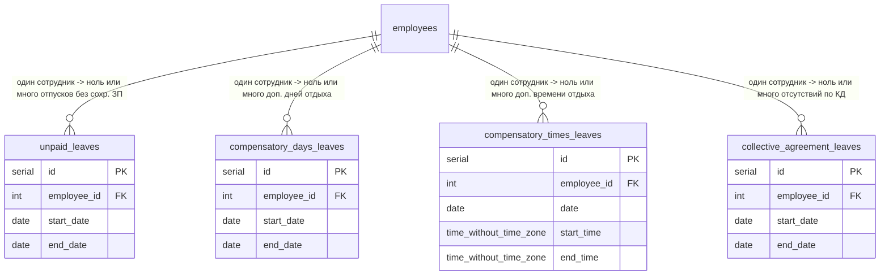

### Обучение, проверки знаний
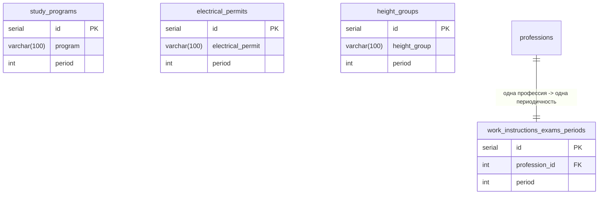
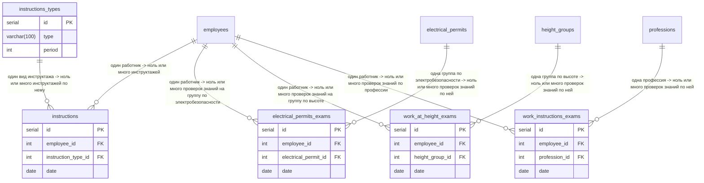
## Аутентификация
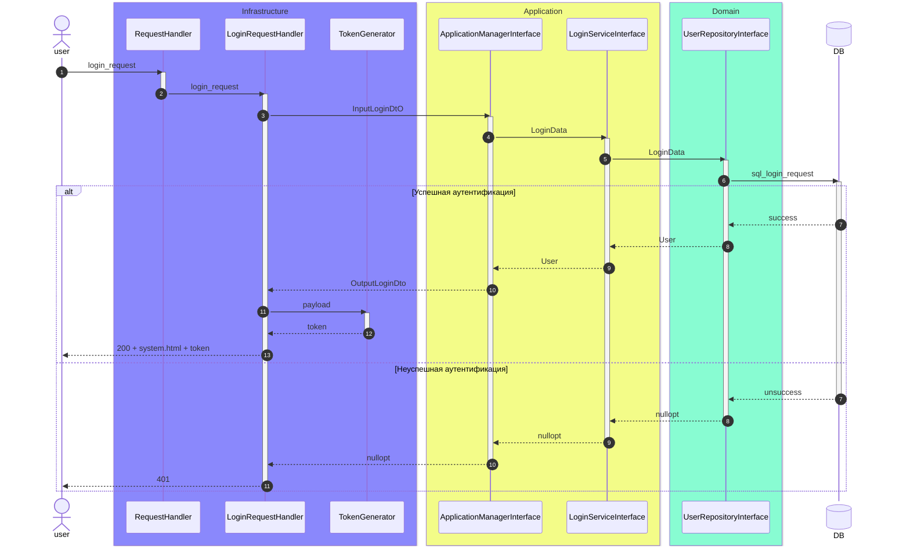
## Модуль управления подразделением
Модуль предназначен для управления структурой подразделения.
### Инструменты:
+ Добавление участка
+ Удаление участка
+ Добавление штатной единицы
+ Удаление штатной единицы
+ Добавление работника
+ Удаление работника
+ Перевод работника на другой участок
+ Перевод работника на другую штатную единицу

## Модуль табеля учета рабочего времени
Модуль предназначен для фиксации фактически отработанного времени и отсутствий работников.
Модуль предусматривает версионирование табеля рабочего времени между администраторами табеля для поддержания истинности данных при конфликтах разных версий.
+ Системная версия - базовая версия табеля сгенерированная автоматически на год для всего подразделения.
+ Версия техника - измененная техником базовая версия табеля.
+ Версия участка - изменная персоналом участка (начальником участка/мастером) базовая версия табеля.
### Инструменты:
+ Генерация базового табеля.
+ Вывод данных по участку.
+ Изменение данных работника в табеле.
## Модуль обучения
Отслеживает сроки обучения работников, сопостовляет их с табелем учета рабочего времени, составляет график обучения на год.

## Модуль инструктажей 
Отслеживает сроки проведения инструктажей работников.

## Модуль оборудования
Структурирует оборудование производственного цеха.

## Модуль плановых производственных работ
Формирует графики плановых производственных работ. Ведет учет выполненных работ.
